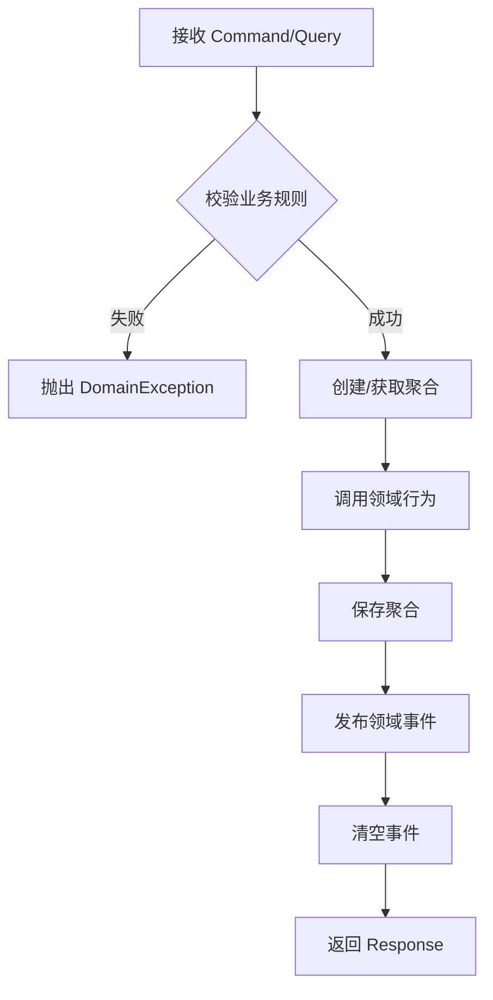
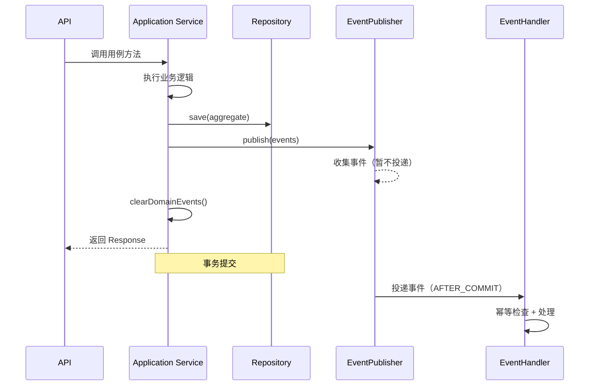
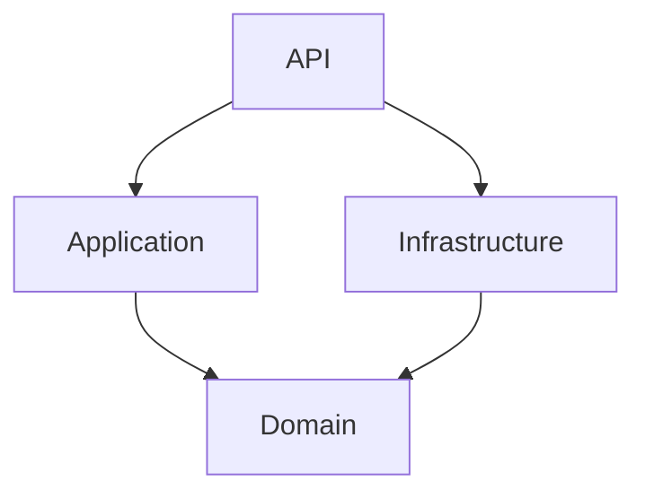

# 应用层（Application Layer）

> 代码审核规则见 rule.md，所有代码必须遵守。

## 定位与职责

应用层负责协调用例、定义事务边界、进行 DTO 转换和事件发布。

**职责**：

- 协调用例：封装业务场景的应用服务，驱动领域模型
- 事务边界：`@Transactional` 定义事务边界
- DTO 转换：接收 Command/Query，返回 Response
- 事件发布：在事务提交后发布领域事件

**不做的职责**：

- 不写核心业务规则（领域层职责）
- 不直接做持久化或第三方调用细节（基础设施层职责）
- 不定义应用层异常，不转换 `DomainException`

***

## 依赖方向

**严格约束**：application 层**只能**依赖 `domain` 和 `common` 模块。

```
application → domain
application → common
```

**绝对禁止**：依赖 `infrastructure`、`interfaces` 或其他任何非授权模块。
违反此约束将导致代码审查直接不通过（P0 级别）。

***

## 包结构

```
application/
├── service/           # 应用服务（必要）
│   └── <Aggregate>Service.java
├── event/             # 事件消费者（需要时）
│   └── <Aggregate>EventHandler.java
├── dto/
│   ├── command/       # 命令 DTO（需要时）
│   ├── query/         # 查询 DTO（需要时）
│   └── response/      # 响应 DTO（需要时）
└── converter/         # MapStruct 转换器（需要时）
```

| 包 | 职责 | 命名规则 |
|---|---|---|
| service/ | 应用服务（用例入口） | 实体名 + Service，如 `UserService` |
| event/ | 事件消费者 | 实体名 + EventHandler，如 `UserCreatedEventHandler` |
| dto/command/ | 写操作输入 | 动作 + 实体名 + Command，如 `CreateUserCommand` |
| dto/query/ | 读操作输入 | 动作 + 实体名 + Query，如 `GetUserQuery` |
| dto/response/ | 操作输出 | 实体名 + Response，如 `UserResponse` |
| converter/ | DTO 转换器 | 实体名 + Converter，如 `UserConverter` |

**必要才定义，勿过度设计**。未使用的包（如 handler/、enums/、utils/）不应定义。

***

## 应用服务

应用服务是用例的入口，负责编排领域对象和基础设施。

**强制约束**：

- 使用 `@Service` + `@RequiredArgsConstructor`
- 通过构造函数注入依赖
- 一个用例一个方法，用例原子化
- 事务边界在方法上（`@Transactional`）

**方法命名规范**：

| 操作类型 | 命名格式 | 示例 |
|---|---|---|
| 创建 | `create<Aggregate>` | `createUser` |
| 更新 | `update<Aggregate>` | `updateUser` |
| 删除 | `delete<Aggregate>` | `deleteUser` |
| 查询单个 | `get<Aggregate>` | `getUser` |
| 查询列表 | `list<Aggregate>` | `listUsers` |
| 分页查询 | `page<Aggregate>` | `pageUsers` |
| 业务操作 | `<动词><Aggregate>` | `activateUser`、`changeEmail` |

```java
@Service
@RequiredArgsConstructor
public class UserService {

    private final UserRepository userRepository;
    private final UserDomainService userDomainService;
    private final DomainEventPublisher eventPublisher;

    @Transactional
    public UserResponse createUser(CreateUserCommand command) {
        // 1. 校验业务规则
        if (!userDomainService.isUsernameUnique(command.getUsername(), null)) {
            throw DomainException.of("USERNAME_TAKEN", "用户名已被占用");
        }

        // 2. 创建聚合
        User user = User.create(command.getUsername(), command.getEmail(), command.getTenantId());

        // 3. 保存
        userRepository.save(user);

        // 4. 发布事件
        eventPublisher.publish(user.getDomainEvents());
        user.clearDomainEvents();

        // 5. 返回响应
        return UserResponse.from(user);
    }
}
```

**用例编排模式**

- **委托型**：业务逻辑完全由领域服务处理，应用层仅做事务包装和事件发布
- **协调型**：跨多个聚合或调用多个领域服务，应用层负责协调

**编排流程**



***

## DTO 规范

**Command / Query**

- 使用 `@Data` + 校验注解（`@NotBlank`, `@Email`, `@Size` 等）
- 仅包含参数定义，**禁止**包含业务逻辑
- **禁止**在 DTO 上使用 JPA 注解

**DTO 验证失败处理**：

- **验证入口**：由 `interfaces` 层 Controller 使用 `@Valid` 触发
- **验证失败**：抛出 `MethodArgumentNotValidException`，由 `GlobalExceptionAdvice` 统一捕获返回 400
- **application 层职责**：仅定义校验注解，不主动触发验证
- **非 HTTP 场景**（如事件消费）：由调用方负责验证或信任已验证数据
- **禁止**在 application 层手动校验 DTO 字段

**Response**

- 使用 `@Data`
- 只暴露必要字段，**禁止**暴露领域实体所有字段
- **禁止**包含敏感信息（如密码、内部 ID）
- **必须**内置静态工厂方法 `from(Aggregate)` 进行转换

```java
@Data
public class UserResponse {
    private String userId;
    private String username;
    private String email;
    private String status;

    public static UserResponse from(User user) {
        UserResponse response = new UserResponse();
        response.setUserId(user.getId().value());
        response.setUsername(user.getUsername());
        response.setEmail(user.getEmail());
        response.setStatus(user.getStatus().getValue());
        return response;
    }
}
```

***

## 领域事件

**发布端**

应用服务在保存聚合后，调用 `eventPublisher.publish()` 发布事件。发布后必须调用 `clearDomainEvents()` 清空事件。

```java
userRepository.save(user);
eventPublisher.publish(user.getDomainEvents());
user.clearDomainEvents();
```

**发布时序**



**消费端**

事件的消费者放在 `application/event/` 目录下。处理逻辑**必须幂等**（通过 `eventId` 去重）。

**强制约束**：
- 使用 `@OnEvent` 注解标记事件处理方法
- **只能**注入应用服务（Application Service），**禁止**直接注入 Repository 或 DomainService
- **禁止**写业务规则，仅做协调
- **必须**捕获异常并记录日志
- **职责**：幂等检查 → 委托给应用服务 → 异常处理和日志

**幂等实现方案**：

**由 infrastructure 层自动处理，开发无需手写去重逻辑。**

- `IdempotentAspect` 切面自动拦截所有 `@OnEvent` 方法
- 自动检查 `eventId` 是否已处理
- 处理成功后自动记录到 `event_idempotent` 表
- 重复事件直接跳过，不执行目标方法

EventHandler 只需关注业务逻辑，无需手写幂等检查。

```java
@Component
public class UserCreatedEventHandler {

    private final UserService userService;

    public UserCreatedEventHandler(UserService userService) {
        this.userService = userService;
    }

    @OnEvent(UserCreatedEvent.class)
    public void handle(UserCreatedEvent event) {
        try {
            // 1. 幂等检查
            if (!isProcessed(event.getEventId())) {
                return;
            }

            // 2. 委托给应用服务处理
            userService.activateUser(new ActivateUserCommand(event.getUserId()));

            log.info("UserCreatedEvent handled: eventId={}", event.getEventId());

        } catch (Exception e) {
            log.error("Failed to handle UserCreatedEvent: eventId={}", event.getEventId(), e);
            throw e; // 触发重试
        }
    }
}
```

***

## 异常规范

**核心原则**

- **一个 `DomainException` 就够了**，不定义应用层异常
- **不做** `DomainException` → 其他异常转换
- **直接让** `DomainException` 向上冒泡到 API 层

```java
@Transactional
public UserResponse createUser(CreateUserCommand command) {
    // ✅ 正确：直接抛出
    if (!userDomainService.isUsernameUnique(command.getUsername(), null)) {
        throw DomainException.of("USERNAME_TAKEN", "用户名已被占用");
    }
    
    // ❌ 错误：捕获并转换
    try {
        // ...
    } catch (DomainException e) {
        throw new ApplicationException(e.getMessage());
    }
}
```

**禁止事项**：

- 禁止定义应用层异常（如 `ApplicationException`）
- 禁止捕获并转换 `DomainException`
- 禁止在应用层定义事务边界（应在应用服务方法上）

***

## 强制约束清单

开发时必须遵守以下约束，违反将导致代码审查不通过：

| 约束项 | 说明 |
|---|---|
| **依赖未授权模块** | **只能依赖 domain 和 common，禁止依赖 infrastructure/interfaces** |
| 定义应用层异常 | 一个 DomainException 就够了 |
| 转换 DomainException | 直接冒泡即可 |
| **无单元测试** | **质量不达标，禁止合并** |
| 测试覆盖率 < 90% | 行/分支覆盖率均需 ≥ 90% |
| 在应用层写核心业务规则 | 应由领域层承担 |
| 在 DTO 上使用 JPA 注解 | 污染领域层，破坏分层 |
| 事件处理器不幂等 | 导致数据重复处理 |
| EventHandler 直接注入 Repository/DomainService | 应委托给应用服务，实现复用 |
| EventHandler 写业务规则 | 应由领域层承担 |
| 在 DTO 转换中写业务规则 | 业务逻辑泄漏 |
| 事务注解放在类级别 | 事务边界不清晰，应放在方法上 |
| Response 缺少 from() 方法 | 违反 DTO 转换规范 |
| 方法命名不符合规范 | 必须使用 `createXxx`/`updateXxx`/`getXxx` 等标准命名 |
| 方法返回领域实体 | 必须返回 Response 或 void，禁止直接暴露实体 |
| 在应用层使用 Stream/Optional 做业务逻辑 | 业务逻辑应在领域层处理 |

***

## 技术注解

| 注解 | 使用场景 | 说明 |
|------|----------|------|
| `@Service` | 应用服务类 | 标记 Spring Bean |
| `@Transactional` | 事务方法 | 定义事务边界（写操作） |
| `@Transactional(readOnly = true)` | 只读事务 | 查询操作优化 |
| `@RequiredArgsConstructor` | 构造器注入 | 强制使用构造器注入，禁止 `@Autowired` |
| `@Data` | DTO | 命令/查询/响应 DTO |
| `@NotBlank`, `@Email`, `@Size` | 参数校验 | DTO 字段校验 |
| `@Component` | 事件处理器 | 标记 EventHandler 为 Spring Bean |
| `@OnEvent` | 事件处理方法 | 标记事件处理，由 infrastructure 自动分发 |
| `@Valid` | Controller 方法参数 | 触发 DTO 校验（在 interfaces 层使用） |

**注意**：
- EventHandler **不需要**加 `@Async`、`@EventListener`、`@KafkaListener`，这些由 `EventDispatcher` 统一处理。
- 应用层**不使用** `@Autowired` 字段注入。

***

## 快速开始：新增一个用例

假设你需要新增一个"激活用户"的功能，按以下步骤依次往下走。

**第一步：确认领域层准备好了**

在写 Application 层之前，先确认 Domain 层已经有：

- 聚合根有对应的业务方法（如 `activate()`）
- Repository 有 `save()` 方法
- DomainService 有获取聚合的方法（如 `getOrThrow()`）

**第二步：创建 Command / Query（如果需要）**

```java
@Data
public class ActivateUserCommand {
    @NotBlank
    private String userId;
}
```

**第三步：创建 Response（如果需要）**

```java
@Data
public class ActivateUserResponse {
    private String userId;
    private String status;

    public static ActivateUserResponse from(User user) {
        ActivateUserResponse response = new ActivateUserResponse();
        response.setUserId(user.getId().value());
        response.setStatus(user.getStatus().getValue());
        return response;
    }
}
```

**第四步：在应用服务中添加方法**

```java
@Transactional
public ActivateUserResponse activate(ActivateUserCommand command) {
    // 1. 获取领域实体
    UserId id = UserId.of(command.getUserId());
    User user = userDomainService.getUserOrThrow(id);

    // 2. 调用领域行为
    user.activate();

    // 3. 保存
    userRepository.save(user);

    // 4. 发布事件（如有）
    eventPublisher.publish(user.getDomainEvents());
    user.clearDomainEvents();

    // 5. 返回
    return ActivateUserResponse.from(user);
}
```

**第五步：添加单元测试**

测试文件名：`UserServiceTest.java`，必须使用 Given-When-Then 结构。

**正常流程测试**：

```java
@Test
void shouldActivateUserSuccessfully() {
    // given
    User user = User.create("test", "test@example.com", "tenant-001");
    when(userDomainService.getUserOrThrow(any(UserId.class))).thenReturn(user);

    // when
    ActivateUserResponse response = userService.activate(new ActivateUserCommand("user-001"));

    // then
    assertThat(response.getStatus()).isEqualTo("active");
    verify(userRepository).save(user);
    verify(eventPublisher).publish(any());
}
```

**异常场景测试**（必须覆盖）：

```java
@Test
void shouldThrowDomainExceptionWhenUserNotFound() {
    // given
    when(userDomainService.getUserOrThrow(any(UserId.class)))
        .thenThrow(DomainException.notFound("User", "user-001"));

    // when & then
    assertThatThrownBy(() -> userService.activate(new ActivateUserCommand("user-001")))
        .isInstanceOf(DomainException.class)
        .hasFieldOrPropertyWithValue("code", "NOT_FOUND");
}
```

***

## 与其他层的关系

- **Application → Domain**：Application 调用 Domain 的服务和工厂，操作 Domain 的实体。
- **Infrastructure → Domain**：Infrastructure 实现 Domain 定义的接口（如 Repository）。
- **API → Application / Infrastructure**：API 层构造 Command，调用 Application 层的服务，获取 Response。

**依赖方向**



这条依赖链确保了领域层的纯粹性：Domain 不依赖任何外层，Infrastructure 仅依赖 Domain 接口。

***

## 开发避坑指南

在开发过程中，以下场景容易踩坑，请特别注意：

### 1. Stream 操作边界

**风险**：容易把业务逻辑（过滤、聚合）写在应用层，导致领域层贫血。

| 场景 | 允许？ | 示例 |
|---|---|---|
| DTO 转换（`map`） | ✅ 允许 | `orders.stream().map(OrderResponse::from)` |
| 简单判空（`orElseThrow`） | ✅ 允许 | `Optional.ofNullable(user).orElseThrow(...)` |
| 业务过滤（`filter`） | ❌ 禁止 | `users.stream().filter(u -> u.isActive())` |
| 数据聚合（`reduce`/`sum`） | ❌ 禁止 | `orders.stream().mapToDouble(Order::getAmount).sum()` |

**建议**：如果需要对集合做过滤或计算，请在 **DomainService** 中提供对应方法。

### 2. EventHandler 设计

**风险**：为了图方便，直接在 EventHandler 中注入 Repository，导致应用服务被架空。

**正确做法**：
1.  **先设计应用服务**：在 `UserService` 中定义 `activateUser` 方法。
2.  **再写 EventHandler**：注入 `UserService` 并调用。

```java
// ✅ 正确：委托给应用服务
public class UserCreatedEventHandler {
    private final UserService userService; // 注入应用服务
    
    @OnEvent(UserCreatedEvent.class)
    public void handle(UserCreatedEvent event) {
        userService.activateUser(new ActivateUserCommand(event.getUserId()));
    }
}
```

### 3. 方法命名一致性

**风险**：使用 `handle`、`process`、`do` 等模糊动词，导致代码可读性差。

**建议**：
*   使用 **动作 + 名词** 格式，如 `activateUser`、`changeEmail`。
*   IDE 中可以配置 **Live Template**，输入 `cuser` 自动生成 `createUser` 方法骨架。
