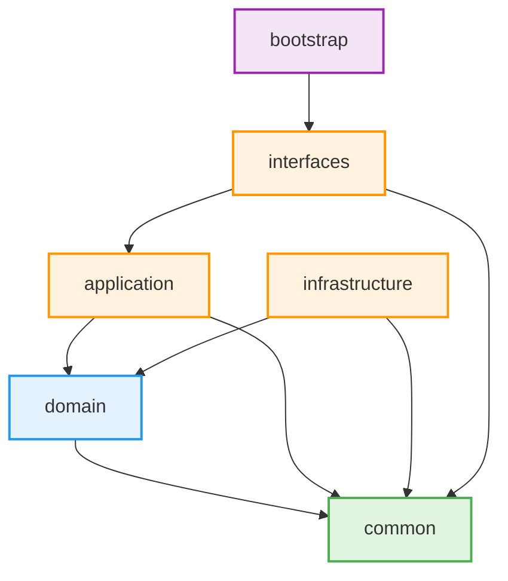

# Common Module (Shared Kernel)

> 代码审核规则见 rule.md，所有代码必须遵守。

## 📦 模块定位

`common` 模块是项目的**共享内核（Shared Kernel）**，提供跨层复用的基础类、接口和注解。
它是整个架构的底座，必须保持纯净、稳定和高内聚。

## 🚫 依赖约束

- **零框架依赖**: 不引入 Spring、JPA、MyBatis 等任何框架。
- **纯 Java 实现**: 仅使用 Java 标准库和 Lombok。
- **无业务逻辑**: 不包含任何业务规则或领域概念。

## 📂 包结构

```text
common/
├── base/             # 基础抽象 (AggregateRoot, BaseRepository)
├── event/            # 事件机制 (DomainEvent, DomainEventPublisher, DomainEventHandler)
│   └── annotation/   # 事件注解 (@OnEvent)
├── exception/        # 领域异常 (DomainException)
├── context/          # 上下文管理 (AppContext, UserContext)
├── id/               # ID 类型/生成 (ID)
├── pagination/       # 分页模型 (PageQuery, PageResult)
├── annotation/       # 通用技术注解 (@Cache, @Lock)
└── pbac/             # PBAC 权限模型
    ├── domain/        # 权限领域模型 (PermissionCode, EvaluationResult, AccessContext, UserPermissionContext)
    ├── service/       # 权限服务接口 (PBACService)
    ├── exception/     # 权限异常 (AccessDeniedException)
    └── annotation/    # 权限注解 (@RequirePolicy, @RequirePermission)
```

| 包 | 职责 | 包含类 |
|---|---|---|
| `base/` | 领域建模基础抽象 | `AggregateRoot`, `BaseRepository` |
| `event/` | 事件处理机制 | `DomainEvent`, `DomainEventPublisher`, `DomainEventHandler` |
| `event/annotation/` | 事件处理注解 | `@OnEvent` |
| `exception/` | 领域异常 | `DomainException` |
| `context/` | 应用上下文 | `AppContext`, `UserContext` |
| `id/` | ID 类型定义 | `ID` |
| `pagination/` | 分页模型 | `PageQuery`, `PageResult` |
| `annotation/` | 通用技术注解 | `@Cache`, `@Lock` |
| `pbac/domain/` | PBAC 领域模型 | `PermissionCode`, `EvaluationResult`, `AccessContext`, `UserPermissionContext` |
| `pbac/service/` | PBAC 服务接口 | `PBACService` |
| `pbac/exception/` | PBAC 异常 | `AccessDeniedException` |
| `pbac/annotation/` | PBAC 注解 | `@RequirePolicy`, `@RequirePermission` |

## 📋 使用规范

### ✅ 应该放什么
- 跨层复用的基础抽象（聚合根、仓储接口）
- 事件机制（事件基类、发布器、处理器接口）
- 通用异常定义
- 线程上下文管理工具
- 分页模型、ID 类型
- 通用技术注解

### ❌ 不应该放什么
- 业务实体或值对象（应放在 `domain` 模块）
- 应用服务或用例编排（应放在 `application` 模块）
- 技术实现细节（应放在 `infrastructure` 模块）
- 任何依赖 Spring 上下文的代码

## 🔗 依赖关系



**依赖说明**

| 模块 | 依赖 | 说明 |
|------|------|------|
| common | 无 | 共享内核，零框架依赖 |
| domain | common | 领域层，纯净业务规则 |
| application | domain, common | 用例编排，事务边界 |
| infrastructure | domain, common | 技术实现，持久化/外部集成 |
| interfaces | application, common | REST 接口，拦截器，异常处理 |
| bootstrap | interfaces | 启动入口，应用配置 |
