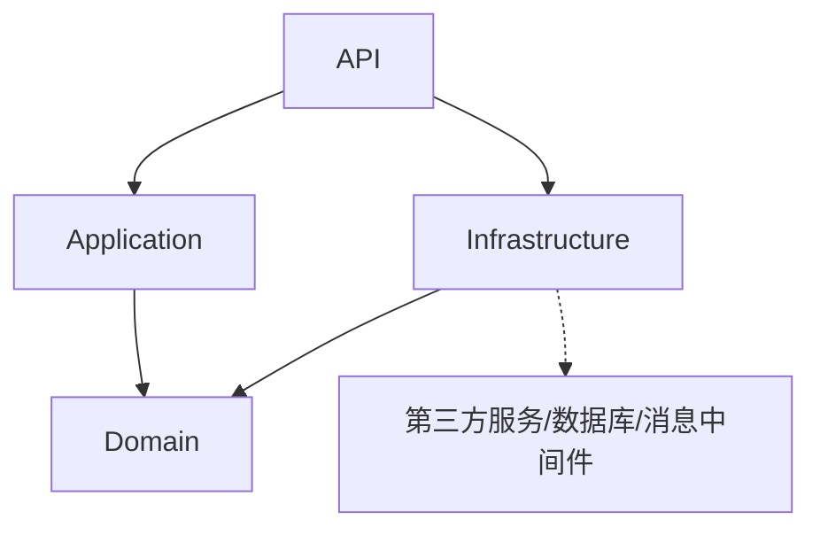
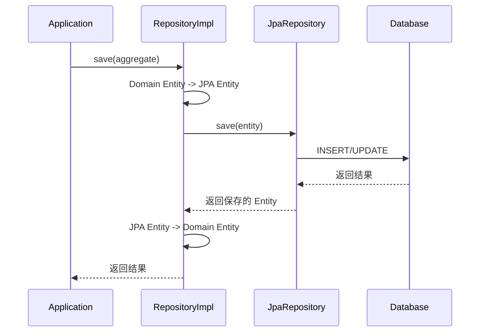

### 基础设施层（Infrastructure Layer）

#### 定位与职责

- 技术底座：提供通用技术封装（JPA、Feign、线程池、上下文透传等）
- 业务实现：实现 `domain` 层定义的接口（Repository、DomainService）
- 数据映射：将领域对象与数据库表/外部系统模型进行转换
- 防腐隔离：对外部系统模型进行适配，避免污染领域层

#### 构成要素

- 技术配置：线程池、上下文透传、序列化、Feign/Ops 配置等
- 仓库实现：实现 `domain.repository` 接口，完成聚合的持久化
- 领域服务实现：实现 `domain.service` 接口，处理跨聚合或外部调用
- 外部客户端：Feign Client、Kafka Producer/Consumer、第三方 SDK 封装
- 数据模型：JPA Entity、MongoDB Document 等库表映射对象

#### 包结构

**核心原则**：技术封装全部在 `config` 下，业务实现直接放在根包。

```
infrastructure/
├── config/              # 技术底座（所有技术封装都在这里）
│   ├── async/           # 线程池配置
│   ├── context/         # Spring 上下文工具
│   ├── dto/             # 通用 DTO（如 R<T>）
│   ├── feign/           # Feign 配置
│   ├── jpa/             # JPA 基础配置
│   │   ├── entity/      # BaseEntity
│   │   ├── repository/  # BaseJpaRepository
│   │   └── statement/   # SQL 拦截处理器（软删除）
├── event/               # 事件处理基础设施
│   ├── entity/          # 幂等记录实体（EventIdempotent）
│   ├── repository/      # 幂等记录 Repository
│   └── aop/             # 幂等切面（IdempotentAspect）
├── persistence/         # 持久化技术实现
│   ├── entity/          # JPA 实体（如 UserEntity）
│   └── repository/      # Spring Data JPA 接口（如 UserJpaRepository）
├── repository/          # 领域仓库实现（实现 domain.repository 接口）
├── service/             # 领域服务实现（使用者填充）
└── feign/               # Feign 客户端（使用者填充）
```

**职责划分**：
- `persistence/entity/` - JPA 实体，映射数据库表，内部封装与 Domain Entity 的转换逻辑
- `persistence/repository/` - Spring Data JPA 接口，提供数据访问能力
- `repository/` - 领域仓库实现，实现 `domain` 层定义的接口，调用 JPA 接口完成持久化

#### 基础组件

脚手架提供了以下基础组件，开箱即用：

**领域基础组件**：
- **BaseEntity**: 包含 `id`, `createTime`, `modifyTime`, `deleted`, `version` 等通用字段
- **BaseJpaRepository**: 继承 `JpaRepository` 和 `JpaSpecificationExecutor`
- **JpaStatementInspector**: SQL 拦截器，自动实现软删除（DELETE 转 UPDATE，SELECT 加 deleted=0）

**上下文透传组件**：
- **AppContext**: ThreadLocal 存储请求头，支持异步线程透传
- **UserContext**: 强类型封装用户 ID、租户 ID、Trace ID
- **AppContextFilter**: 自动提取请求头 + MDC 注入 TraceID
- **ContextTaskDecorator**: 异步线程池上下文 + MDC 透传
- **FeignRequestInterceptor**: Feign 调用自动透传 x- 开头的请求头

**通用组件**：
- **SpringContext**: 获取 Spring Bean 的工具类
- **R<T>**: 统一响应体

**事件幂等组件**：
- **@Idempotent**: 标记事件处理方法需要幂等保护（common/event/annotation/）
- **IdempotentAspect**: AOP 切面，自动拦截 `@OnEvent` 方法执行幂等检查
- **EventIdempotent**: 幂等记录实体，存储已处理的事件 ID
- **EventIdempotentRepository**: 幂等记录 Repository

#### 实现原则

- 端口驱动：仅实现接口，避免让领域层依赖具体类
- 防腐层（ACL）：对不兼容/不稳定的外部模型做转换与隔离
- 失败优先：超时、重试、熔断、降级策略明确且可观察
- 幂等与一致性：入库/出库与消息处理确保幂等，事务边界清晰
- 可测试：为适配器提供替身（Fake/Stub），便于应用层与领域层测试

#### 依赖关系

**Maven 依赖方向**（严格单向，禁止循环依赖）：



**各层依赖明细**：

| 模块 | 依赖 | 说明 |
|------|------|------|
| `domain` | 无内部依赖 | 纯领域模型，仅依赖 Lombok、commons-lang3 等基础工具库 |
| `application` | `domain` | 应用编排，通过接口调用领域层 |
| `infrastructure` | `domain` | 技术实现，实现 domain 定义的接口 |
| `api` | `application` + `infrastructure` | 组装层，将应用层与技术层装配为可运行服务 |

**关键约束**：
- `infrastructure` 仅依赖 `domain`，不依赖 `application`
- `application` 仅依赖 `domain`，不依赖 `infrastructure`
- `api` 是唯一同时依赖 `application` 和 `infrastructure` 的层，负责 Bean 装配与启动

#### 仓库实现模式



#### 不该做的事

- 不编码业务规则与不变式，这应由领域层负责
- 不向上泄漏技术细节，应用层与领域层只依赖端口接口
- 不直接返回外部系统的原始模型到上层
- 不依赖 `application` 模块

#### 与其他层的关系

- **Domain → Infrastructure**：Domain 定义接口（Repository、EventPublisher），Infrastructure 实现
- **Application → Infrastructure**：Application 通过 Domain 接口间接使用 Infrastructure 实现
- **API → Infrastructure**：API 不直接依赖 Infrastructure

任何技术替换（数据库/消息/客户端）仅在基础设施层发生，不影响其他层。
